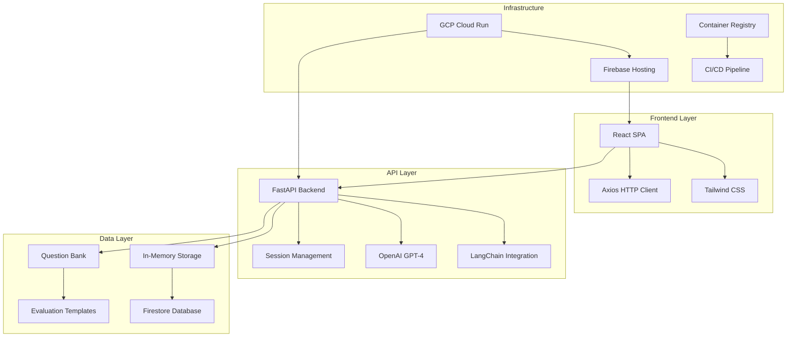
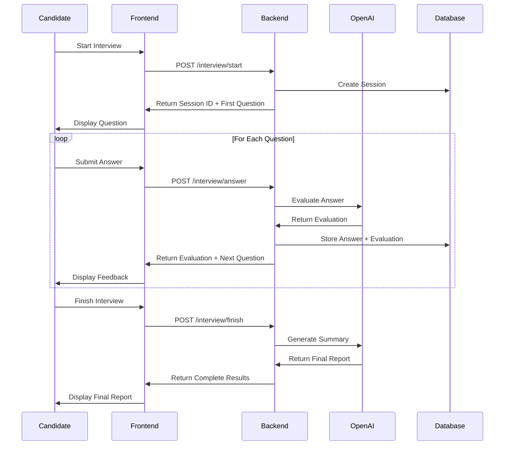

# Design Document: AI-Powered Excel Mock Interviewer

## Executive Summary

This document outlines the design and implementation strategy for an AI-powered Excel skills assessment system. The solution addresses the critical need for efficient, consistent, and scalable Excel proficiency evaluation in hiring processes.

## Problem Statement

### Business Context
- **Challenge**: Manual Excel technical interviews are time-consuming and inconsistent
- **Impact**: Slows hiring pipeline, affects growth targets, inconsistent evaluations
- **Opportunity**: AI-driven solution can standardize and accelerate the process

### Requirements Analysis
1. **Structured Interview Flow**: Multi-turn conversation simulating real interview
2. **Intelligent Answer Evaluation**: AI-powered assessment beyond keyword matching
3. **Agentic Behavior**: State management and interviewer-like interactions
4. **Constructive Feedback**: Comprehensive performance summary and recommendations

## Solution Architecture

### High-Level Design



### Technology Stack Justification

#### Backend: FastAPI + LangChain
**Why FastAPI?**
- **Performance**: One of the fastest Python frameworks
- **Type Safety**: Built-in Pydantic validation
- **Documentation**: Automatic OpenAPI/Swagger docs
- **Async Support**: Native async/await for better concurrency

**Why LangChain?**
- **Structured Prompts**: Consistent evaluation templates
- **LLM Integration**: Seamless OpenAI API integration
- **Chain Management**: Composable prompt chains
- **Error Handling**: Robust error handling for LLM calls

#### Frontend: React + Tailwind CSS
**Why React?**
- **Component Architecture**: Reusable, maintainable UI components
- **State Management**: Efficient state handling for interview flow
- **Ecosystem**: Rich ecosystem and community support
- **Performance**: Virtual DOM for optimal rendering

**Why Tailwind CSS?**
- **Rapid Development**: Utility-first approach speeds up styling
- **Consistency**: Design system ensures consistent UI
- **Responsive**: Built-in responsive design utilities
- **Performance**: Purged CSS for optimal bundle size

#### LLM: OpenAI GPT-4o-mini
**Why GPT-4o-mini?**
- **Cost-Effective**: 60x cheaper than GPT-4 while maintaining quality
- **Performance**: Sufficient for interview evaluation tasks
- **Speed**: Faster response times for better user experience
- **Reliability**: Stable API with good uptime

#### Deployment: GCP Cloud Run + Firebase Hosting
**Why GCP Cloud Run?**
- **Serverless**: No infrastructure management required
- **Scalability**: Auto-scaling based on demand
- **Cost-Effective**: Pay only for actual usage
- **Container Support**: Docker-based deployment

**Why Firebase Hosting?**
- **Performance**: Global CDN for fast content delivery
- **Integration**: Seamless integration with GCP services
- **SSL**: Automatic SSL certificates
- **Deployment**: Simple deployment process

## Detailed System Design

### 1. Interview Flow Architecture



### 2. Data Models

#### Session Model
```python
class InterviewSession:
    session_id: str
    candidate_name: str
    current_question: int
    answers: List[Answer]
    started_at: datetime
    finished_at: Optional[datetime]
    status: SessionStatus
```

#### Answer Model
```python
class Answer:
    question_id: int
    question: str
    answer: str
    evaluation: Evaluation
    timestamp: datetime
```

#### Evaluation Model
```python
class Evaluation:
    technical_accuracy: int  # 0-5
    practical_application: int  # 0-5
    clarity: int  # 0-5
    completeness: int  # 0-5
    overall_score: float  # 0-5
    feedback: str
    strengths: List[str]
    improvements: List[str]
```

### 3. Question Bank Design

#### Question Structure
```python
class Question:
    id: int
    question: str
    category: str  # "Lookup Functions", "Data Analysis", etc.
    difficulty: str  # "Basic", "Intermediate", "Advanced"
    expected_keywords: List[str]
    evaluation_criteria: Dict[str, str]
```

#### Question Categories
1. **Lookup Functions** (VLOOKUP, HLOOKUP, INDEX/MATCH)
2. **Cell References** (Absolute, Relative, Mixed)
3. **Data Analysis** (Pivot Tables, Data Validation)
4. **Data Management** (Duplicates, Filtering, Sorting)
5. **Formulas** (Conditional, Statistical, Date/Time)
6. **Charts & Visualization** (Dynamic Charts, Conditional Formatting)
7. **Advanced Features** (Macros, Power Query, Power Pivot)

### 4. AI Evaluation System

#### Evaluation Prompt Engineering
```python
EVALUATION_PROMPT = """
You are an expert Excel interviewer evaluating a candidate's response.

Question: {question}
Candidate Answer: {answer}

Evaluate the candidate's answer based on:
1. Technical Accuracy (0-5): Correctness of Excel concepts and syntax
2. Practical Application (0-5): Real-world applicability and examples
3. Clarity (0-5): Communication and explanation quality
4. Completeness (0-5): Thoroughness of the response

Provide constructive feedback and suggestions for improvement.

Respond in this EXACT JSON format:
{
    "technical_accuracy": <int>,
    "practical_application": <int>,
    "clarity": <int>,
    "completeness": <int>,
    "overall_score": <float>,
    "feedback": "<detailed feedback string>",
    "strengths": ["<strength1>", "<strength2>"],
    "improvements": ["<improvement1>", "<improvement2>"]
}
"""
```

#### Evaluation Criteria
- **Technical Accuracy**: Correct Excel syntax, function usage, and concepts
- **Practical Application**: Real-world examples, business context, and use cases
- **Clarity**: Clear communication, logical structure, and explanation quality
- **Completeness**: Thorough coverage of the question, addressing all aspects

### 5. State Management

#### Session State
```python
class SessionState:
    def __init__(self, session_id: str):
        self.session_id = session_id
        self.current_question = 0
        self.answers = []
        self.status = "active"
        self.start_time = datetime.now()
    
    def add_answer(self, answer: Answer):
        self.answers.append(answer)
        self.current_question += 1
    
    def is_complete(self) -> bool:
        return self.current_question >= len(QUESTIONS)
    
    def get_progress(self) -> float:
        return self.current_question / len(QUESTIONS)
```

#### Frontend State Management
```javascript
const [interviewState, setInterviewState] = useState({
  sessionId: null,
  candidateName: '',
  currentQuestion: 0,
  answers: [],
  evaluation: null,
  isFinished: false
});
```

## Implementation Strategy

### Phase 1: Core Functionality (Day 1)
1. **Backend API Development**
   - FastAPI application setup
   - OpenAI integration with LangChain
   - Session management
   - Question bank implementation
   - Evaluation system

2. **Basic Frontend**
   - React application setup
   - Interview flow components
   - API integration
   - Basic styling with Tailwind

### Phase 2: Enhancement & Deployment (Day 2)
1. **Frontend Polish**
   - Advanced UI components
   - Responsive design
   - Progress tracking
   - Results visualization

2. **Deployment Setup**
   - Docker containerization
   - GCP Cloud Run deployment
   - Firebase Hosting setup
   - CI/CD pipeline

3. **Testing & Validation**
   - API testing
   - Frontend testing
   - End-to-end testing
   - Performance optimization

## Scalability Considerations

### Horizontal Scaling
- **Stateless Backend**: FastAPI application is stateless, enabling easy horizontal scaling
- **Load Balancing**: GCP Cloud Run automatically handles load balancing
- **Database Scaling**: Firestore automatically scales with usage

### Performance Optimization
- **Caching**: Redis caching for frequently accessed data
- **CDN**: Firebase Hosting provides global CDN for static assets
- **Async Processing**: FastAPI's async support for better concurrency

### Cost Optimization
- **Serverless Architecture**: Pay only for actual usage
- **Efficient LLM Usage**: Optimized prompts to minimize token usage
- **Resource Management**: Appropriate resource allocation for Cloud Run

## Security & Compliance

### Data Protection
- **API Key Security**: Environment variables for sensitive data
- **Input Validation**: Pydantic models for request validation
- **CORS Configuration**: Proper CORS settings for production

### Privacy Considerations
- **Data Minimization**: Only collect necessary candidate information
- **Data Retention**: Configurable data retention policies
- **GDPR Compliance**: Right to deletion and data portability

## Monitoring & Analytics

### Application Monitoring
- **Health Checks**: Built-in health check endpoints
- **Error Tracking**: Comprehensive error logging
- **Performance Metrics**: Response time and throughput monitoring

### Business Analytics
- **Interview Completion Rates**: Track candidate drop-off points
- **Evaluation Accuracy**: Monitor AI evaluation quality
- **User Experience**: Frontend performance and usability metrics

## Risk Assessment & Mitigation

### Technical Risks
1. **LLM API Failures**: Implement retry logic and fallback mechanisms
2. **High Latency**: Optimize prompts and implement caching
3. **Cost Overruns**: Monitor usage and implement rate limiting

### Business Risks
1. **Evaluation Bias**: Regular validation against expert assessments
2. **Candidate Experience**: User testing and feedback incorporation
3. **Scalability Issues**: Load testing and performance monitoring

## Success Metrics

### Technical Metrics
- **API Response Time**: < 2 seconds average
- **System Uptime**: > 99.9%
- **Error Rate**: < 1%

### Business Metrics
- **Interview Completion Rate**: > 90%
- **Evaluation Accuracy**: > 85% agreement with expert assessments
- **Candidate Satisfaction**: > 4.0/5.0 rating

## Future Roadmap

### Short-term Enhancements (1-3 months)
- **Multi-language Support**: Interview questions in different languages
- **Advanced Analytics**: Detailed performance analytics dashboard
- **Custom Question Sets**: Role-specific question collections

### Medium-term Features (3-6 months)
- **Integration APIs**: HR system integrations (Workday, BambooHR)
- **Video Interviews**: Optional video recording and analysis
- **Adaptive Questioning**: Dynamic question selection based on performance

### Long-term Vision (6-12 months)
- **Skill Mapping**: Detailed skill gap analysis and training recommendations
- **Team Assessments**: Group interview capabilities
- **Mobile App**: Native mobile application for candidates

## Conclusion

This AI-powered Excel Mock Interviewer represents a significant advancement in technical skills assessment. By leveraging modern AI capabilities, cloud infrastructure, and user-centered design, the system provides a scalable, efficient, and accurate solution for Excel proficiency evaluation.

The architecture is designed for growth, with clear separation of concerns, robust error handling, and comprehensive monitoring. The implementation strategy balances speed with quality, ensuring a working prototype within the 2-day timeline while maintaining production-ready standards.

The system addresses the core business problem while providing a foundation for future enhancements and integrations. With proper execution, this solution can significantly improve the hiring process efficiency and candidate experience.

